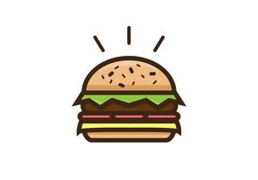
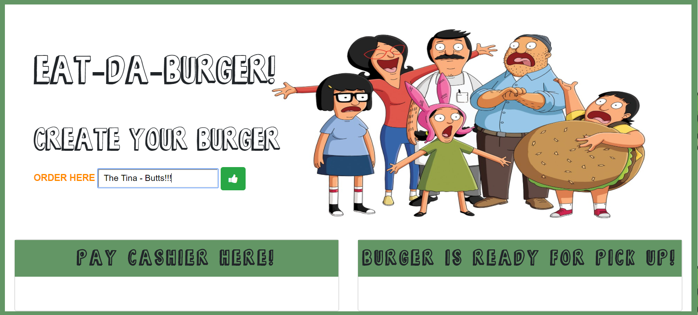
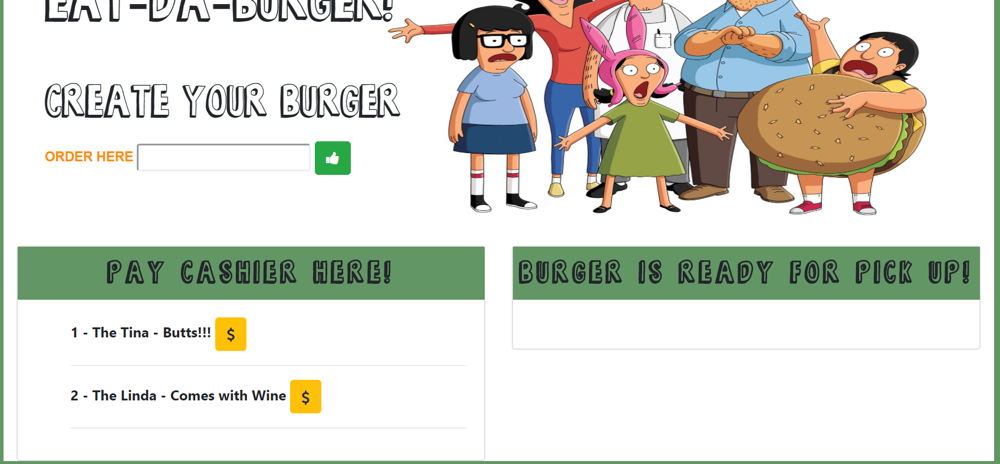
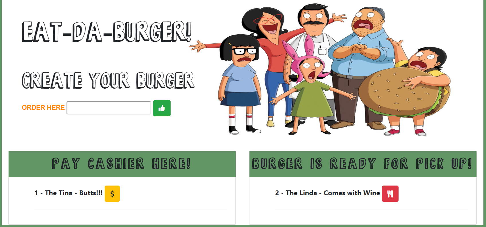
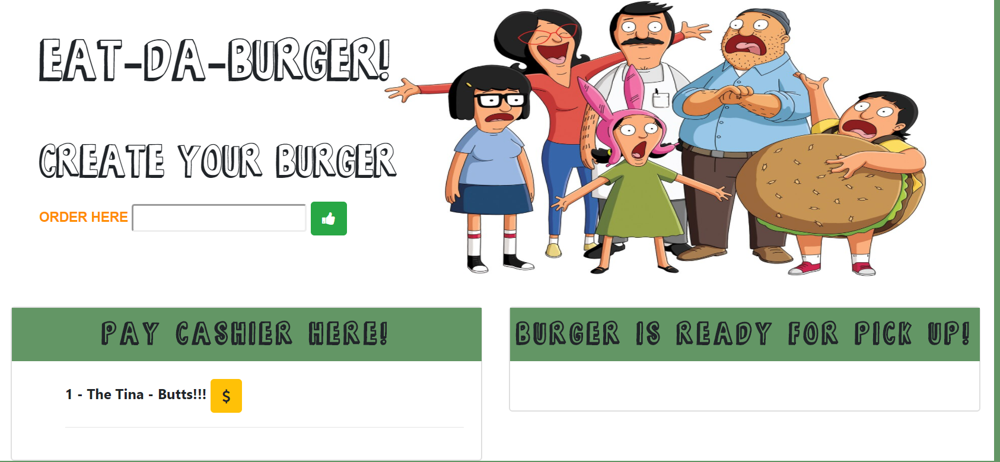

# Eat-Da-Burger

 Homework for week 14 of NU Bootcamp.  A full stack, MVC(Mode-View-Controller) application utilizing (POST) requests to create your burger and (GET) requests to choose that burger and (DELETE) to pick up that burger once ready or "devoured". 

## Live: (https://susan-burger1-live.herokuapp.com/)

  

###  How the app works:
This project calls the user to enter their burger of choice.  When you place an order, the burger you enter in the form field is added to the list of burgers on the left side of the screen. Each burger in the list has a $ button. Clicking this button moves the burger from the list on the left side of the screen to the list on the right. The list on the right is a list of burgers that are ready to be picked up. Each burger in this list has a button that allows you to remove the burger, which deletes the burger from the user interface as well as from the MySQL database. See screen shots below for app flow.

### Technologies
This project uses MySQL, Node, Express, Handlebars, ORM (Object Relational Mapper). Node and MySQL are used to query and route data in the application. Express is the backend web framework used for this application, and Handlebars is a templating language that is used to generate the HTML.

### Backend Technologies
* Node.js 
* MySQL 
* Express 
* ORM - Object Relational Mapping 

### Frontend Technologies
* HTML
* CSS
* Bootstrap
* FontAwesome 
* Javascript
* jQuery 
* Handlebars

### Screen Shots:

#### Enter the burger you would like to order in the "order here" text field. Click "thumbs up" if that is what you would like.

#### The order will go to the cashier box - click on the payment icon when ready.  

#### The burger will go to the pick up window.

#### Click on the cutlery icon to pick up your burger and the order will be removed. YUM!

## Acknowledgments 
* Jumbotron artwork copywrite Bob's Burgers - Fox Entertainment.  Used for educational purposes ONLY.

  
  